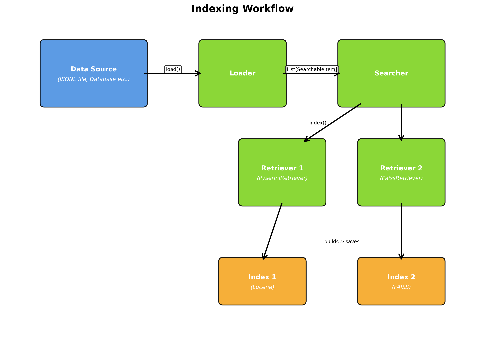
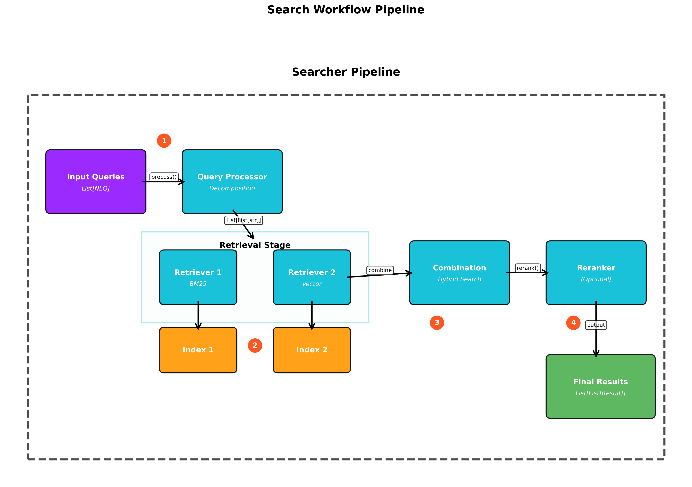
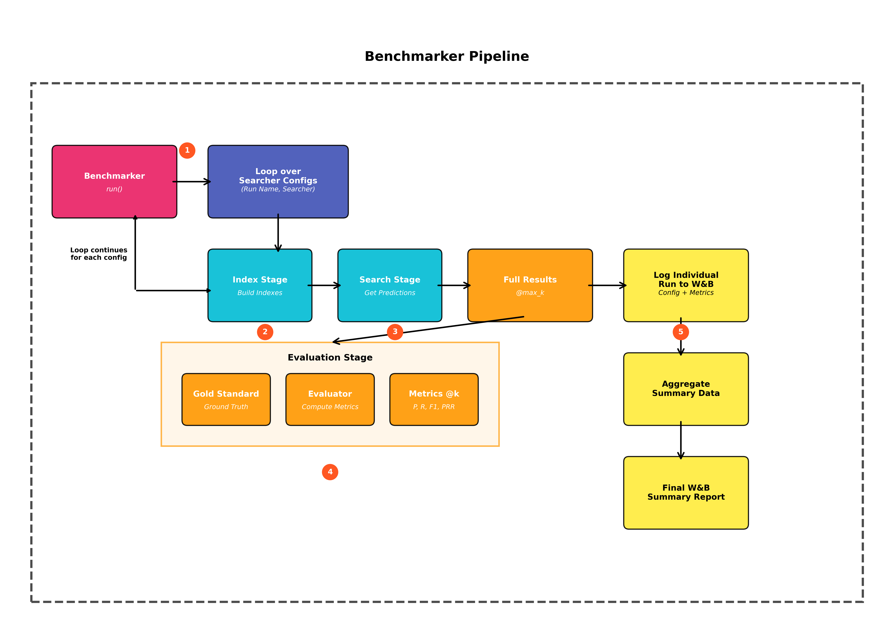

# `nlp_retrieval` Module Documentation

## 1. Overview

The `nlp_retrieval` module provides a modular, configurable, and extensible framework for building and benchmarking end-to-end text retrieval pipelines. It is designed around a "composition over inheritance" model, where a central `Searcher` orchestrates various independent components to perform indexing and searching tasks.

## 2. Core Components

The framework is built upon a set of abstract base classes (ABCs), each defining a specific role in the retrieval pipeline.

### 2.1. Data Models (`core/models.py`)

-   **`SearchableItem`**: The canonical representation of a single piece of data to be indexed.
    -   `item_id: str`: A unique identifier for the item.
    -   `content: str`: The main text content used for retrieval.
    -   `metadata: Dict`: A dictionary for any associated metadata.
-   **`RetrievalResult`**: Represents a single item returned by a search.
    -   `item: SearchableItem`: The retrieved item.
    -   `score: float`: The relevance score assigned by the retriever or reranker.

### 2.2. Component Interfaces (ABCs)

-   **`BaseLoader`**: Responsible for loading data from a source (e.g., file, database) and converting it into a `List[SearchableItem]`.
    -   `load() -> List[SearchableItem]`
-   **`BaseUserQueryProcessor`**: Transforms a batch of user queries into a format suitable for retrieval (e.g., decomposition, keyword extraction).
    -   `process(nlqs: List[str]) -> List[List[str]]`
-   **`BaseRetriever`**: Manages the indexing of `SearchableItem`s and the retrieval of candidate results.
    -   `index(items: List[SearchableItem], output_path: str)`
    -   `retrieve(processed_queries: List[List[str]], output_path: str, k: int) -> List[List[RetrievalResult]]`
-   **`BaseReranker`**: Re-scores a list of candidate `RetrievalResult`s to improve ranking quality.
    -   `rerank(nlqs: List[str], results: List[List[RetrievalResult]], k: int) -> List[List[RetrievalResult]]`

## 3. Workflow and Orchestration

The `Searcher` and `Benchmarker` classes orchestrate the interaction between these components.

### 3.1. Indexing Workflow

The indexing process is initiated by the `Searcher.index()` method.

1.  **Load**: An instance of a `BaseLoader` (e.g., `JsonlLoader`, `DatabaseLoader`) is used to load data from a source into a `List[SearchableItem]`.
2.  **Index**: The `Searcher` passes this list to the `index()` method of each configured `BaseRetriever` (e.g., `PyseriniRetriever`, `FaissRetriever`).
3.  **Store**: Each retriever builds its specific index (e.g., a Lucene index, a FAISS vector index) and saves it to a dedicated subdirectory within the specified `output_path`.

*Figure 1: The indexing workflow showing data flow from source through loader to multiple retrievers creating their respective indexes.*

### 3.2. Search Workflow

The search process is initiated by the `Searcher.search()` method.

1.  **Process Query**: The input `List[str]` of natural language queries is passed to the configured `BaseUserQueryProcessor`. This produces a `List[List[str]]`, where each inner list contains the query/queries for a single retrieval operation (e.g., original query + sub-queries).
2.  **Retrieve**: The `Searcher` passes the processed queries to each configured `BaseRetriever`.
    -   Each retriever is responsible for executing all sub-queries and returning a single, deduplicated list of `RetrievalResult`s for each original query.
3.  **Combine (Hybrid Search)**: The `Searcher` collects the results from all retrievers. It creates a single, deduplicated pool of candidate results for each original query.
4.  **Rerank (Optional)**: If a `BaseReranker` is configured, this combined pool of candidates is passed to its `rerank()` method. The reranker re-scores the items based on the original NLQ and returns a final, sorted list truncated to `k`.
5.  **Return**: If no reranker is present, the combined results are sorted by their original scores and truncated. The final `List[List[RetrievalResult]]` is returned.

*Figure 2: The complete search pipeline from query input through processing, retrieval, combination, and optional reranking.*

## 4. Benchmarking

The `Benchmarker` class implements and end-to-end retrieval pipeline and logging to wandb:

-   **Input**: It accepts a list of named `Searcher` configurations, a `BaseLoader`, queries, a gold standard dataset, and evaluation parameters (`k_values`).
-   **Execution**: For each configuration, it:
    1.  Calls `Searcher.index()` to build the necessary indexes.
    2.  Calls `Searcher.search()` once with the maximum `k` value to get a full set of predictions.
    3.  Uses a `RetrievalEvaluator` to compute metrics (Precision, Recall, F1, Perfect Recall Rate) on the full result set.
    4.  Iteratively slices the full results to calculate metrics for each specified `k` value.
-   **Logging**: If configured, it logs detailed run configurations and performance metrics to Weights & Biases, including a final summary table comparing all runs.

*Figure 3: The benchmarking pipeline showing the complete flow from configuration through evaluation and logging.*
