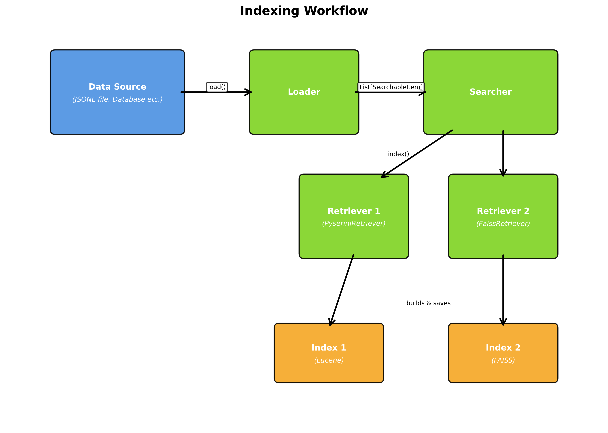
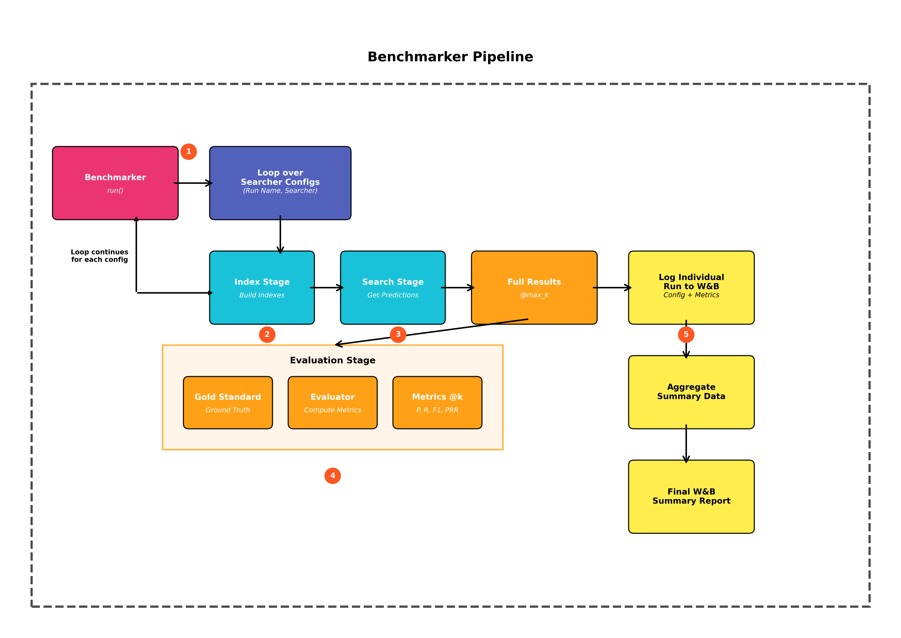

# Developer Onboarding Guide

Welcome to the developer guide for the `nlp_retrieval` framework.

This document provides a comprehensive overview of the framework's architecture and a step-by-step guide for extending it with new components (like loaders, retrievers, or rerankers) and benchmarking their performance.

## Table of Contents

1. [Framework Overview](#1-framework-overview)
   * [Core Principles](#core-principles)
   * [Directory Structure](#directory-structure)
   * [Core Data Models](#core-data-models)
2. [System Architecture &amp; Workflows](#2-system-architecture-workflows)
   * [Core Components &amp; Interfaces](#core-components-interfaces)
   * [Indexing Workflow](#indexing-workflow)
   * [Search Workflow](#search-workflow)
3. [Part 1: Adding a New Component](#3-part-1-adding-a-new-component)
   * [General Steps](#general-steps)
   * [Component-Specific Guides](#component-specific-guides)
   * [Assembling a Pipeline](#assembling-a-pipeline)
4. [Part 2: Evaluating Your New Component](#4-part-2-evaluating-your-new-component)
   * [Key Evaluation Classes](#key-evaluation-classes)
   * [The Matching Logic](#the-matching-logic)
   * [How to Run a Benchmark](#how-to-run-a-benchmark)
   * [Interpreting the Output](#interpreting-the-output)

---

## 1. Framework Overview

The `nlp_retrieval` module provides a modular, configurable, and extensible framework for building and benchmarking end-to-end text retrieval pipelines. It is designed around a "composition over inheritance" model, where a central `Searcher` orchestrates various independent components to perform indexing and searching tasks.

### Core Principles

The framework is built on a few key principles:

- **Modularity:** Each component is a self-contained, swappable Python class.
- **Clear Interfaces:** Components inherit from an Abstract Base Class (ABC) that defines a strict contract for its methods.
- **Standardized Data Flow:** We use Pydantic models (`SearchableItem`, `RetrievalResult`) to pass data between components.
- **Batch-First Design:** All components are designed to operate on batches (`List`) of queries or results, enabling efficient processing.

### Directory Structure

All retrieval-related code resides in `darelabdb/nlp_retrieval/`.

```
nlp_retrieval/
├── core/                      # Pydantic models & ABCs
├── loaders/                   # Reads data from sources
├── user_query_processors/     # Processes raw user queries
├── retrievers/                # Indexes data and retrieves candidates
├── rerankers/                 # Re-scores and ranks candidates
├── evaluation/                # Tools for calculating metrics
├── benchmarking/              # Orchestrator for running benchmarks
└── searcher.py                # The main pipeline orchestrator
```

### Core Data Models

Before you start, familiarize yourself with the two fundamental data models defined in `darelabdb/nlp_retrieval/core/models.py`:

- **`SearchableItem`**: The canonical representation of a single piece of data to be indexed.
  - `item_id: str`: A unique identifier for the item.
  - `content: str`: The main text content used for retrieval.
  - `metadata: Dict`: A dictionary for any associated metadata.
- **`RetrievalResult`**: Represents a single item returned by a search.
  - `item: SearchableItem`: The retrieved item.
  - `score: float`: The relevance score assigned by the retriever or reranker.

---

## 2. System Architecture & Workflows

The framework is built upon a set of abstract base classes (ABCs), each defining a specific role in the retrieval pipeline. The `Searcher` and `Benchmarker` classes orchestrate the interaction between these components.

### Core Components & Interfaces

- **`BaseLoader`**: Responsible for loading data from a source (e.g., file, database) and converting it into a `List[SearchableItem]`.
- **`BaseUserQueryProcessor`**: Transforms a batch of user queries into a format suitable for retrieval (e.g., decomposition, keyword extraction).
- **`BaseRetriever`**: Manages the indexing of `SearchableItem`s and the retrieval of candidate results.
- **`BaseReranker`**: Re-scores a list of candidate `RetrievalResult`s to improve ranking quality.

### Indexing Workflow

The indexing process is initiated by the `Searcher.index()` method.

1. **Load**: An instance of a `BaseLoader` (e.g., `JsonlLoader`) is used to load data from a source into a `List[SearchableItem]`.
2. **Index**: The `Searcher` passes this list to the `index()` method of each configured `BaseRetriever` (e.g., `PyseriniRetriever`, `FaissRetriever`).
3. **Store**: Each retriever builds its specific index (e.g., a Lucene index, a FAISS vector index) and saves it to a dedicated subdirectory.


*Figure 1: The indexing workflow showing data flow from source through loader to multiple retrievers creating their respective indexes.*

### Search Workflow

The search process is initiated by the `Searcher.search()` method.

1. **Process Query**: The input queries are passed to the configured `BaseUserQueryProcessor`.
2. **Retrieve**: The `Searcher` passes the processed queries to each configured `BaseRetriever`.
3. **Combine (Hybrid Search)**: The `Searcher` collects and deduplicates the results from all retrievers into a single pool of candidates.
4. **Rerank (Optional)**: If a `BaseReranker` is configured, this combined pool is passed to its `rerank()` method for re-scoring.
5. **Return**: The final, sorted list of results is returned.


*Figure 2: The complete search pipeline from query input through processing, retrieval, combination, and optional reranking.*

---

## 3. Part 1: Adding a New Component

### General Steps

1. **Identify the Component Type:** Determine which category your new class falls into: `loaders`, `user_query_processors`, `retrievers`, or `rerankers`.
2. **Create the File:** Add a new Python file in the appropriate directory (`cross_dataset_discovery/darelabdb/nlp_retrieval/retrievers/my_new_retriever.py`).
3. **Inherit from the ABC:** Your new class must inherit from the correct Abstract Base Class (e.g., `BaseRetriever`).
4. **Implement All Abstract Methods:** Your IDE or Python itself will require you to implement all methods marked with `@abstractmethod` in the parent ABC.
5. **Use Core Data Models:** Your component must accept and/or return the Pydantic models (`SearchableItem`, `RetrievalResult`) as defined in the ABC contract.

### Component-Specific Guides

#### Creating a New Loader

- **Inherit from:** `BaseLoader`
- **Implement:**
  - `__init__(self, ...)`: Accept necessary parameters, like file paths.
  - `load(self) -> List[SearchableItem]`: Read your data source and create a list of `SearchableItem` objects.

#### Creating a New User Query Processor

- **Inherit from:** `BaseUserQueryProcessor`
- **Implement:**
  - `__init__(self, ...)`: Accept any configuration for your processing logic.
  - `process(self, nlqs: List[str]) -> List[List[str]]`: Receives a list of raw queries and must return a list of lists, where each inner list contains the processed strings (e.g., sub-queries, keywords) for an input query.

#### Creating a New Retriever

- **Inherit from:** `BaseRetriever`
- **Implement:**
  - `__init__(self, ...)`: Initialize your retrieval model, parameters, etc.
  - `index(self, items: List[SearchableItem], output_path: str) -> None`: Build your search index from the items and save all index files inside the provided `output_path`.
  - `retrieve(self, processed_queries_batch: List[List[str]], output_path: str, k: int) -> List[List[RetrievalResult]]`: Load the index and process the batch of sub-queries, returning a single, aggregated, and deduplicated list of `RetrievalResult` objects for each original query.

#### Creating a New Reranker

- **Inherit from:** `BaseReranker`
- **Implement:**
  - `__init__(self, ...)`: Initialize your reranking model.
  - `rerank(self, nlqs: List[str], results_batch: List[List[RetrievalResult]], k: int) -> List[List[RetrievalResult]]`: For each query and its candidates, compute new scores, sort the results, and truncate to the top `k`.

### Assembling a Pipeline

Once you have created your custom component, you can use it in a `Searcher` pipeline.

```python
from darelabdb.nlp_retrieval.searcher import Searcher
from darelabdb.nlp_retrieval.loaders.jsonl_loader import JsonlLoader
from darelabdb.nlp_retrieval.retrievers.dense_retriever import FaissRetriever
# Import your new custom component
from darelabdb.nlp_retrieval.rerankers.my_reranker import MyReranker

# 1. Initialize the components
my_loader = JsonlLoader(file_path="path/to/data.jsonl", content_field="text")
my_retriever = FaissRetriever(model_name_or_path="BAAI/bge-m3")
my_custom_reranker = MyReranker(model_name="some-model") # Your new reranker

# 2. Assemble the Searcher
searcher = Searcher(
    retrievers=[my_retriever],
    reranker=my_custom_reranker
)

# 3. Run the pipeline
INDEX_DIR = "./my_index"
searcher.index(loader=my_loader, output_path=INDEX_DIR)

# 4. Search
queries = ["what is the capital of france?", "what is the best gpu for gaming?"]
results = searcher.search(nlqs=queries, output_path=INDEX_DIR, k=5)

print(results)
```

---

## 4. Part 2: Evaluating Your New Component

After creating a new component, the next step is to measure its performance. The framework provides tools to run automated benchmarks and calculate standard information retrieval metrics.


*Figure 3: The benchmarking pipeline showing the complete flow from configuration through evaluation and logging.*

### Key Evaluation Classes

- **`RetrievalEvaluator`**: The core engine for calculating metrics like Precision, Recall, and F1-Score.
- **`Benchmarker`**: The high-level orchestrator that runs different Searcher configurations, calls the RetrievalEvaluator, and logs results to the console and Weights & Biases.

### The Matching Logic

This is the most important concept in our evaluation system. A predicted item is considered a "correct hit" if its metadata is a superset of a gold standard item's metadata.

**Example:**

- Gold Standard Metadata: `{'page_title': 'Mashable'}`
- Prediction Metadata: `{'page_title': 'Mashable', 'source': 'some_sentence'}` → **MATCH**

The evaluator also automatically handles granularity. It inspects the metadata keys in your gold standard to determine the level of uniqueness (e.g., by `page_title`, or by `page_title` and `source`). It then deduplicates predictions at that level before calculating metrics.

### How to Run a Benchmark

The `run_benchmark.py` script provides a template for setting up and running an evaluation.

#### Step 1: Prepare the Corpus Loader

The Benchmarker requires an initialized loader object that returns a `List[SearchableItem]`.

```python
from darelabdb.nlp_retrieval.loaders.jsonl_loader import JsonlLoader

loader = JsonlLoader(file_path="path/to/corpus.jsonl", ...)
```

#### Step 2: Prepare Queries and Gold Standard

You must create two lists in memory:

- `queries: List[str]`: A list of query strings.
- `gold_standard: List[List[RetrievalResult]]`: A parallel list where each inner list contains the correct `RetrievalResult` objects for the corresponding query. For the gold standard, only the metadata field is used for matching.

#### Step 3: Configure Your Searcher Pipelines

Create an initialized `Searcher` instance for each configuration you want to test, including your new component.

```python
# Configuration 1: Baseline
bm25_searcher = Searcher(retrievers=[PyseriniRetriever()])

# Configuration 2: Your new component
my_new_searcher = Searcher(retrievers=[MyNewRetriever()])

# Create a list of named configurations for the Benchmarker
searcher_configs = [
    ("BM25_Baseline", bm25_searcher),
    ("My_New_Retriever", my_new_searcher),
]
```

#### Step 4: Initialize and Run the Benchmarker

Pass all the prepared objects to the Benchmarker and call `.run()`.

```python
from darelabdb.nlp_retrieval.benchmarking.benchmarker import Benchmarker
from darelabdb.nlp_retrieval.evaluation.evaluator import RetrievalEvaluator

evaluator = RetrievalEvaluator()
benchmarker = Benchmarker(
    searcher_configs=searcher_configs,
    evaluator=evaluator,
    loader=loader,
    queries=queries,
    gold_standard=gold_standard,
    k_values=[1, 5, 10],
    output_path="./benchmark_results",
    use_wandb=True,
    wandb_project="my-retrieval-project",
    wandb_entity="my-username",
)

benchmarker.run()
```

### Interpreting the Output

- **Console Output**: The script will print progress, search speed (QPS), and a final summary table comparing all runs.
- **Weights & Biases (W&B) Dashboard**: If `use_wandb=True`, the Benchmarker logs detailed configurations and metrics for each run, along with an aggregated summary table, making it easy to compare pipeline performance.
